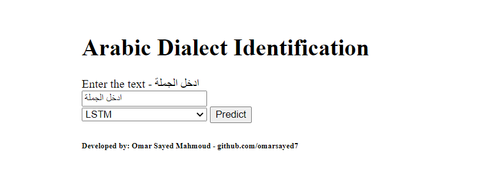
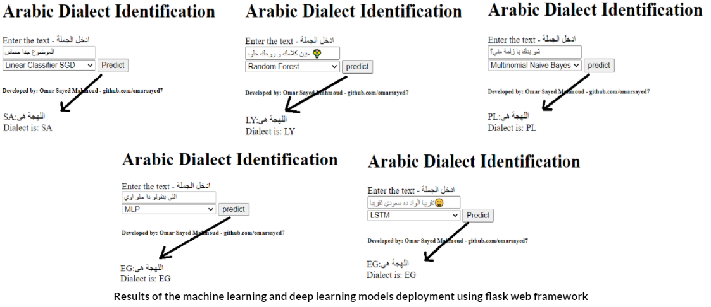

# Arabic Dialect Identification

Application for detecting and identifying the arabic dialects using machine learning and NLP.

  

###### Demo: https://arabic-dialect-identification.herokuapp.com/

## Introduction

The nature of the Arabic language being a macro, morphological language with many varieties makes it one of the challenging languages for natural language processing and language identification. Machine learning and NLP build effective arabic dialect identification prediction model trained on 450k tweets across 18 classes(Arabic countries).

Training three classical machine learning models

- Multinomial Nayive Bayes Classifier
- Random Forest Classifier
- Linear Model with SGD learning

Training two deep neural networks architecture

- Multi-layer Perceptron
- Long short-term memory(LSTM)

## Trained models and saved tokenizers

#### [NOTE] make sure you make `models` directory in `src` direcotry and copy the trained models to it.

- [SGD](https://drive.google.com/file/d/1nqftY_XpBVdbu9qU7kEU4vEtmRxlian1/view?usp=sharing)
- [Random Forest](https://drive.google.com/file/d/13gO43PIPPzDU0UrDc_7qoE5NWkKyGNjD/view?usp=sharing)
- [Multinomial NB](https://drive.google.com/file/d/1--8XMNgnHROt8Yo2LkYwyHomxUyE3CgX/view?usp=sharing)
- [MLP](https://drive.google.com/file/d/12SU4HqGCuob_A0lHsBTCn0sMtuhAVKHv/view?usp=sharing)
- [LSTM](https://drive.google.com/file/d/1fiorMT0FtHHKIwGdkLAVOC6s4qUERDer/view?usp=sharing)
- [LSTM Tokenizer](https://drive.google.com/file/d/1l6K7NmkDXej5hw3CGeBFL0BHBA5AIzw9/view?usp=sharing)
- [MLP Tokenizer](https://drive.google.com/file/d/1--Fg2xwaIv1R9u5e4uR2vuKjk6ARpLOj/view?usp=sharing)

## Usage

Before you get your hands dirty with the code, the flow of the project is, first you have to fetch the data from the internet, using HTTP request and [dialect_tweets.csv](https://github.com/omarsayed7/arabic-dialect-identification/blob/main/src/data/dialect_dataset.csv) file you can fetch the whole dataset and store it in another csv file for data preprocessing and training models.

[Note] IPython notebook version of the code avaliable [here](https://github.com/omarsayed7/arabic-dialect-identification/tree/main/src/notebooks)

#### Installing dependencies

    pip install -r requirements.txt

#### Data fetching

    python data_fetching.py

#### Data pre-processing

    python data_preprocessing.py

#### Machine learning and deep learning model training

##### Machine learning model training

    python machine_learning_model_training.py [-m [model_type]]

    --model_type                 Choose the model you want to train from Multinomial NB, RF, and SGD

##### Simple neural network(Dense layers) model training

    python dense_layers_model_training.py

##### LSTM neural network model training

    python lstm_model_training.py

#### Inference the trained models

    python text_inference.py [-m [model_type] -t [text]]

    --model_type                 Choose the model you want to train from LSTM, Dense_NN, SVM, RF, and SGD
    --text                       The text you want to classify

#### Running the API locally

##### [Note] running this command in the main directory

    FLASK_APP=model_deploy.py flask run

## Results

  

## Conclusion

- The data set was fairly large, which made it quite interesting.
- The dataset suffers from class imbalance, and the text needed plenty of cleaning.
- The dataset can be clustered into a lower number of classes (Egyptian, Levantine, Iraqi, Arabian Peninsula, and Maghreb dialects) this step can lead to better results in both classical machine learning and deep learning models.
- One of ways to solve class imbalance and the most widely used approach to synthesizing new examples is SMOTE.
- Evaluating the models based on F1-score because the dataset was quite imbalance.
- Getting 49% accuracy using linear classifier(SVM) with SGD learning was quite good as we trained on the 18 class.
- Training one epoch of LSTM model take +2.5 hours because of not accessing to gpu power, however after 5 epochs the model reaches to 50% accuracy on the test set, if the model continue training and using early stopping criteria definitely the model will reach to better accuracy.
- LSTM model outperforms to the rest of the models even if it isn’t trained enough on the dataset.
- Techniques for increasing the accuracy are using pre-trained embedding models such as word2vec trained on arabic data and using state of the art pre-training BERT for arabic language understanding.
